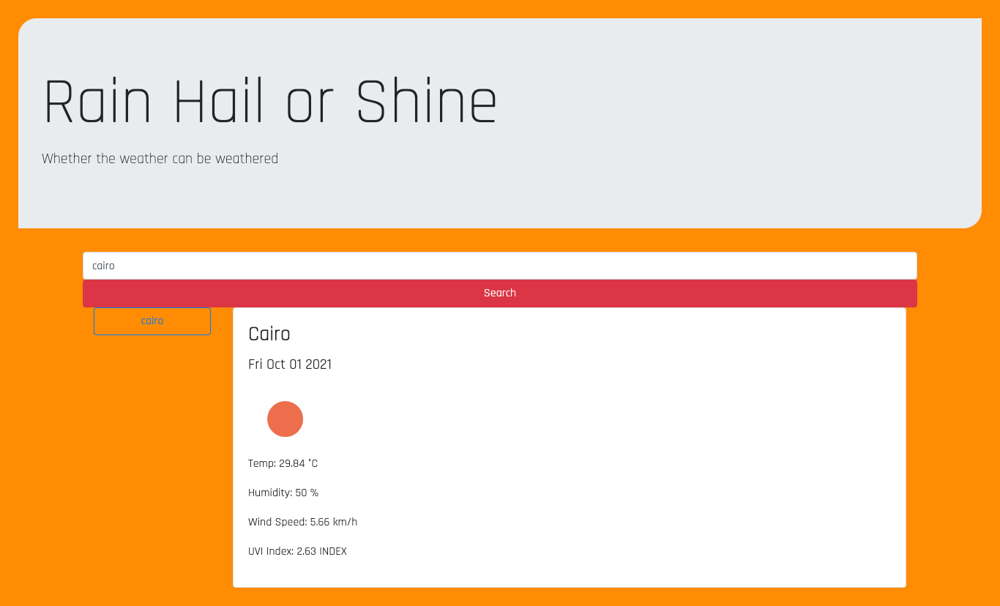

# Weather-Dashboard
Site can be accessed here: https://github.com/konnenhannaford/Weather-Dashboard
Github Repo: The source can be retrieved by cloning and pulling from https://konnenhannaford.github.io/Weather-Dashboard/

# About
This page is a weather page that allows users to show teh weather froma round the world.  It should allow for users to view the current day as well as a forecast of over 5 days.  

# Tools used
- HTML, CSS, Javascript, J-query, Bootstrap

# Updates

- When users search a city, they are presented with info on current weather coniditions
- When users search a city, there searches are listed on the page and can be clicked on again to re-show current conditions
- When users search a city, they are presented with the city name, the date, an icon representation of weather conditions, the temperature, the humidity, the wind speed, and the UV index for today
- When users searchg a city, they are presented with the an icon representation of weather conditions, the temperature, the humidity, for the next 5 days

# Making Changes
- Repo is public and can be updated by all via https://github.com/konnenhannaford/Weather-Dashboard

# Learnings and changes
Completing this has increased familiarity with Bootstrap.  I really struggle with Javascript though and have taken time off to ensure that this doesnt happen again.  updates that still need to be made incldue:
- UV Index being able to be updated on colour
- Ability to replace current search with new search
- Update to include future work

# Screnshot of deployed page

